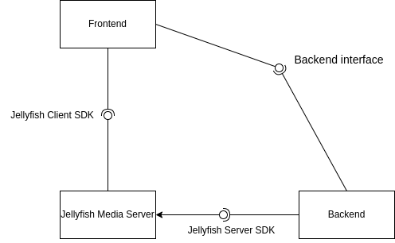
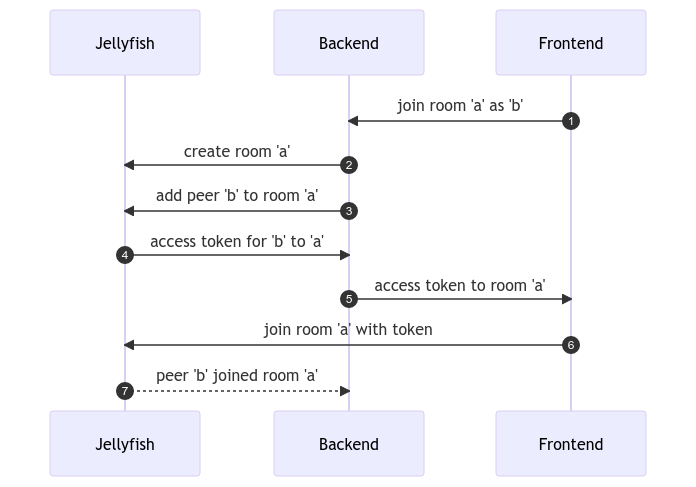
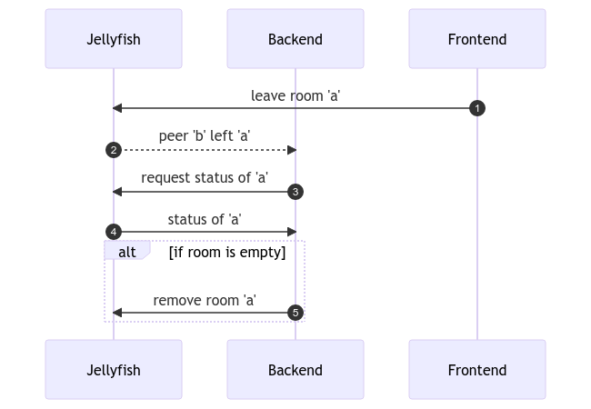

# Architecture of Jellyfish-based Videoroom

This document presents a proposed architecture of Videoroom running on Jellyfish Media Server. It aims to reimplement an existing set of features.

## Existing feature set
Current implementation of videoroom doesn't have a lot of custom business logic. In essence, it only:
1. Serves the FE application
2. Creates the Room when new peer attempts to join
3. Deletes the Room after the last peer leaves
4. Manages the signalling channel.

The signalling will be managed by the Jellyfish and relevant SDKs, so we only need to worry about the first 3 points.

## High level view

A single instance of Jellyfish-based Videoroom will have 3 distinct components:
1. Jellyfish - black-box media server, from the perspective of Videoroom.
2. Backend - a simple application responsible for controlling the Jellyfish instance, serving and interacting with Frontend. This is where all business logic and main development of backend Videoroom features will take place
3. Frontend - SPA application exposed for clients. Uses `Jellyfish Client SDK` to join the session running on the instance of Jellyfish. Communicates with Backend to indicate a desire to join the room and obtain an access token.

Since the original videoroom didn't scale, we're not concerned with managing more than one instance of Jellyfish as part of one deployment at this moment.

## Backend application implementation details
Being a very simple application, backend for Videoroom can also be extremely simple. In particular, it MUST:

- serve the frontend application

- expose an endpoint that the Frontend can use to indicate the desire to join a specific room.

  In response, the Backend must reply either with an error or with an access token.

It is possible to avoid storing any information about the state of the Jellyfish instance or the peers.

### Procedure of joining the room
The procedure of joining the room is best described with a sequence diagram.

<!-- https://mermaid.live/edit#pako:eNplkb2OwyAQhF8FbeMm9wIUKawzhdtraTawjrkz4ONHpyjKuwdin6XYVIj5ZmfE3kF5TcAh0m8mp-jT4DWglY6Vgzl5l-2FgnTLy4whGWVmdIn1gmFkPU3TbTBxPAJtV4EW1Q85fZTFSxbBu_TSF0J0H-dz23H27Y1jwXvLGmwq2VyaBWkr0gvOVCBMtEE7FbVmM1GoRpb8DuvFmoNKUYwFKC3Z4Df8faDYk4eB4j_3vfifSeNi2XLX4K1bNZDeLHACS8Gi0WUv9-qSkEayJIGXq6YB85QkSPcoaN3R180p4ClkOkGedfmTdY3AB5wiPZ6EXpiO -->

Mind you, it is ok for videoroom to make an API call to create the room as long as it ignores the `Already exists` error.
It is assumed that the peer can be added to the Room as soon as a request to create it returns a successful response.

### Procedure of leaving the room
With effectively stateless server, client can simply disconnect from the Jellyfish instance. There is no need for the Backend to be involved.

### Procedure of terminating the room
Procedure of terminating the room is described by the following sequence diagram:

<!-- https://mermaid.live/edit#pako:eNplkb9uwyAQh1_lxOIleQGGDFbN4LUry8U-GlT-uHBEsqK8e3Fo1DZmQvd9HPyOm5jiTEKKTF-FwkRvFj8Seh2gLiwcQ_FnSjq0yoKJ7WQXDAyjAswwknOrsfmyF_phE3qcPinMe6weWKUY-MGboYbj6TQqCY7wSpBi9NBh1-CojpX2g4SFKEF37qpm-Ffon6fTliczZEYuGaL516T1eGE_mR2DNe1em4H8wmsjL_193D3vTwxxEJ6SRzvX4d62mhZ8IU9ayLqdyWBxrIUO96pug35fwyQkp0IHUZYZ-fkXQhp0me7flGGHRw -->

This feature as described here requires the implementation of server notifications in the Jellyfish Media Server.
An alternative approach is possible, but it would require us to:

- manually monitor the status of each peer
- forward connection errors received by the SDK to the backend
- persist information about rooms and peers in them

### Handling room and peer crashes
In this scenario, peers are expected to repeat the procedure of joining the room.

## Missing Jellyfish features
As of March 20th 2023, the following features, required to transition the Videoroom to Jellyfish as specified by this document, are missing:
- [ ] Server notifications - their introduction greatly simplifies Videoroom backend by removing the need to manually monitor the status of peers
